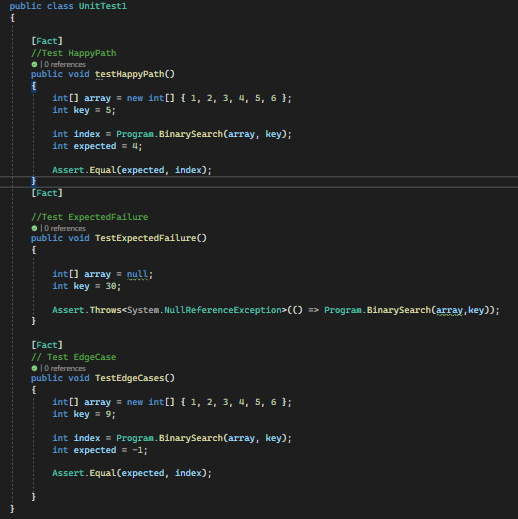

# Array Binary Search
+ The challenge is to implement a function called BinarySearch in C# that takes a sorted array as input and a Key and returns The index of key if found otherwise return -1.

#
## -Whiteboard Process

#
## -Approach & Efficiency
+ The approach I took for the BinarySearch function is as follows:    
1.Create the BinarySearch function that takes a sorted array and key.    
2.Initialize low and high values and give them appropriate values.     
3.Make while loop to check if the low<= high.    
4.Inside the while initialize int mid and give it the middle index then do if statement to check if the mid equal ,less than or greater then the key and change the high or low value according to it.     
5.return -1 if the key not found in the array.        
 
+ -The complexity is O(log n) because the BinarySearch function divides the search space in half until the desired element is found.    
-The space complexity is O(1).
#
## -Solution
+ Copy the code provided in the image and write it at the visual studio then pass array to the method and run the code (Ctrl+F5).
#
## The code :

#
## The unit Testing: 

