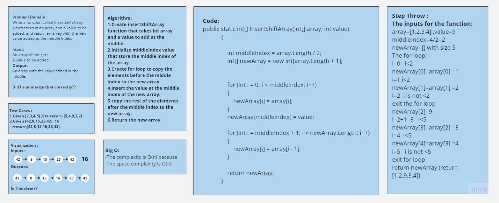
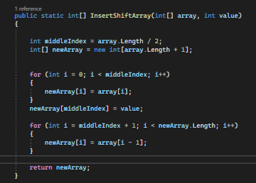

# Array Insert Shift
+ The challenge is to implement a function called InsertShiftArray in C# that takes an array as input and a value and returns a new array with the value added in the middle index.

#
## -Whiteboard Process

#
## -Approach & Efficiency
+ The approach I took for the InsertShiftArray function is as follows:    
1.Create insertShiftArray function that takes int array and a value to add at the middle.         
2.Initialize middleIndex value that store the middle index of the array.         
3.Create for loop to copy the elements before the middle index to the new array.           
4.Insert the value at the middle index of the new array.             
5.copy the rest of the elements after the middle index to the new array.            
6.Return the new array.          
 
+ -The complexity is O(n)
- and The space complexity is O(n) .

#
## -Solution
+ Copy the code provided in the image and write it at the visual studio then pass array to the method and run the code (Ctrl+F5).
#
## The code :

