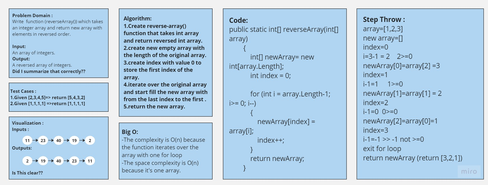
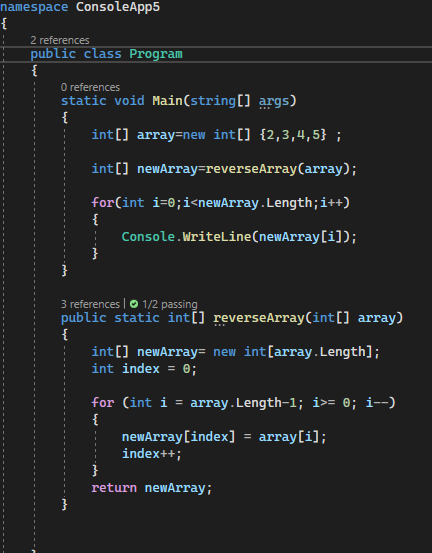
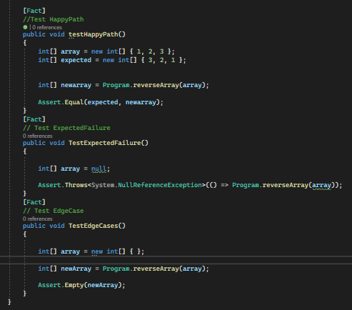

# Array Reverse
+ The challenge is to implement a function called reverseArray in C# that takes an array as input and returns a new array with the elements in reverse order.

#
## -Whiteboard Process

#
## -Approach & Efficiency
+ The approach I took for the reverseArray function is as follows:    
1.Create reverse-array() function that takes int array and return reversed int array.   
2.create new empty array with the length of the original array.    
3.create index with value 0 to store the first index of the array.    
4.iterate over the original array and start fill the new array with from the last index to the first .    
5.return the new array.   
+ -The complexity is O(n) because the function iterates over the array with one for loop    
-The space complexity is O(n) because it's one array.

#
## -Solution
+ Copy the code provided in the image and write it at the visual studio then pass array to the method and run the code (Ctrl+F5).
#
## The code :

## Unit Testing :
+ Here is a photo of unit testing to this code :      

